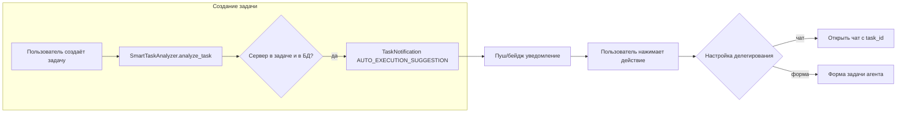

# Логика ИИ-агентов: чат, задачи, серверы

## Текущее состояние (кратко)

- **Задачи**: При создании вызывается [SmartTaskAnalyzer.analyze_task](tasks/smart_analyzer.py) — извлекает упоминания серверов, матчит с [Server](servers/models.py), при совпадении создаёт [TaskNotification](tasks/models.py) типа `AUTO_EXECUTION_SUGGESTION` с `action_url=/tasks/{id}/auto-execute/`.
- **Проблемы**: Роуты для уведомлений и «одобрить выполнение» не заведены в [tasks/urls.py](tasks/urls.py) — нет `approve_auto_execution`, `notifications_list`, `notification_action`, `notification_mark_read`. То есть уведомления создаются, но пользователь не может по ним действовать.
- **ИИ-анализ**: [TaskAIAssistant.analyze_task](tasks/ai_assistant.py) — промпты на английском, нет контекста «какие серверы есть в системе», нет явной логики «задача делегируема ИИ да/нет».
- **Выполнение**: [TaskExecutor](tasks/task_executor.py) подключается через [ssh_manager](app/tools/ssh_tools.py); пароль для серверов с `password`/`key_password` не расшифровывается (`Password decryption not fully implemented`). Пароль агент не должен получать — соединение должно устанавливать приложение по сохранённым данным.
- **Чат vs форма**: Сейчас в [task_card.html](tasks/templates/tasks/task_card.html) есть «Обсудить» → `/chat/?task_id=X` и «Execute» → `/?task_id=X`. Нет настройки «при делегировании открывать чат или форму задачи».

---

## Целевая логика

1. При создании задачи ИИ сразу анализирует её (**только русский**), учитывая **список доступных серверов** (имена/хосты без паролей).
2. Если задача реально выполнима (например, «проверить место на prod» + есть сервер `prod`) → создаётся уведомление «задачу можно делегировать ИИ».
3. Пользователь получает **push/индикатор** и по клику выполняет действие; действие ведёт либо в **чат с контекстом задачи**, либо в **форму задачи агента** — выбор из **настроек**.
4. Агент имеет **чёткие инструкции и ограничения** (запрет удаления без подтверждения и т.п.), отвечает **только на русском**.
5. Подключение к серверам делает **бэкенд** по уже сохранённым учётным данным; агенту передаётся только **connection_id** (или аналогичный handle), пароль не передаётся.

---

## 1. Анализ задачи при создании (ИИ + серверы)

**Файлы:** [tasks/smart_analyzer.py](tasks/smart_analyzer.py), [tasks/ai_assistant.py](tasks/ai_assistant.py).

- В **SmartTaskAnalyzer.analyze_task** перед/параллельно с текущим анализом передавать в ИИ **список серверов пользователя**: имя, хост, порт (без паролей и ключей). Формат: краткий JSON или текст вида «Доступные серверы: prod (host1), stage (host2)».
- В **TaskAIAssistant.analyze_task**:
  - Добавить параметр `servers_context: list[dict]` (или строку с перечислением).
  - Переписать системный/пользовательский промпт: **только русский**, явные поля:
    - `can_delegate_to_ai: true|false` — «ИИ может выполнить эту задачу сам (есть нужный сервер и тип операции допустим)».
    - `reason` — краткое обоснование на русском.
    - Остальное по необходимости: `recommended_agent`, `estimated_time`, `complexity`.
  - Жёстко требовать ответ на русском и парсинг полей из JSON.
- В **SmartTaskAnalyzer** использовать `can_delegate_to_ai` и совпадение сервера: создавать `TaskNotification` с типом `AUTO_EXECUTION_SUGGESTION` только когда ИИ вернул `can_delegate_to_ai=True` и матч по серверу уже есть (или дополнительно проверять по полю `reason`/серверу).
- Уведомление оставлять с `action_data`: `task_id`, `server_id`, при необходимости `action`: `delegate`.

---

## 2. Роуты и действие «Делегировать ИИ»

**Файлы:** [tasks/urls.py](tasks/urls.py), [tasks/views.py](tasks/views.py), [tasks/smart_analyzer.py](tasks/smart_analyzer.py).

- В **tasks/urls.py** добавить:
  - `path('<int:task_id>/approve-auto-execution/', views.approve_auto_execution, name='approve_auto_execution')`
  - `path('notifications/', views.notifications_list, name='notifications_list')`
  - `path('notifications/<int:notification_id>/read/', views.notification_mark_read, name='notification_mark_read')`
  - `path('notifications/<int:notification_id>/action/', views.notification_action, name='notification_action')`
- В **notification_action** (или отдельный endpoint «делегировать») по `action=delegate` или `approve_auto_execution`:
  - Вызывать существующую логику одобрения и запуска выполнения (как в `approve_auto_execution`).
  - В `JsonResponse` или редиректе учитывать настройку пользователя: «при делегировании открывать чат или форму задачи» — возвращать `redirect_to: 'chat' | 'task_form'` и при необходимости `url` (например, `/chat/?task_id=X` или страница формы задачи).
- В **SmartTaskAnalyzer._create_auto_execution_notification** заменить `action_url=f'/tasks/{task.id}/auto-execute/'` на URL, который реально существует, например `/tasks/{task.id}/approve-auto-execution/` или универсальный endpoint уведомлений с `action=approve_auto_execution` и `task_id` в теле.

---

## 3. Настройка «При делегировании: чат или форма задачи»

**Файлы:** модель/настройки пользователя или [core_ui](core_ui/) (если настройки хранятся там), [core_ui/templates/settings.html](core_ui/templates/settings.html) или отдельная вкладка, фронт задач/уведомлений.

- Ввести настройку уровня пользователя (или глобальную): **delegate_ui**: `chat` | `task_form`.
  - Вариант без миграций: хранить в JSON-поле настроек (если есть) или в [ModelConfig](app/core/model_config.py)/отдельной модели «UserPreference» — в зависимости от того, как у вас уже устроены настройки.
  - Вариант с миграцией: добавить поле в профиль/расширение User или в существующую модель настроек.
- В **Settings** добавить блок «Делегирование задач ИИ»:
  - Радиокнопки или select: «При делегировании открывать: чат с контекстом задачи / форму задачи агента».
- При срабатывании действия по уведомлению «делегировать» бэкенд отдаёт редикт или `redirect_to` + `url` в зависимости от `delegate_ui`; фронт открывает чат (`/chat/?task_id=X`) или форму задачи.

---

## 4. Пуш-уведомление о «задачу можно делегировать»

**Файлы:** механизм доставки, [tasks/views.py](tasks/views.py), фронт (base.html / task_list / общий хедер).

- Сейчас уведомления только в БД. Нужен канал «мгновенно сообщить пользователю».
  - **Минимум:** в шапке/общей части (base или task_list) — иконка «колокольчик» с бейджем количества непрочитанных; по таймеру или при фокусе запрашивать `GET /tasks/notifications/` и показывать список; клик по «делегировать» → POST в `notification_action` и переход по `redirect_to`/`url`.
  - **Расширение:** Web Push (VAPID, service worker) — подписка пользователя, при создании `TaskNotification` типа `AUTO_EXECUTION_SUGGESTION` дергать push-сервис. Требует отдельной настройки и поддержки на фронте.
- В плане заложить **этап 1**: бейдж + список уведомлений в интерфейсе и вызов делегирования по клику; этап 2 (опционально): настоящий браузерный push.

---

## 5. Инструкции и ограничения агента, только русский

**Файлы:** [app/core/orchestrator.py](app/core/orchestrator.py) (системный промпт ReAct), [app/agents/react_agent.py](app/agents/react_agent.py), по необходимости [tasks/task_executor.py](tasks/task_executor.py) (подготовка промпта для агента).

- В системном промпте оркестратора (ReAct) прописать:
  - **Язык:** «Отвечай и рассуждай только на русском. Все сообщения пользователю — на русском.»
  - **Сценарии:** разрешённые типы операций на сервере: чтение/проверка (df, свободное место, логи и т.п.), выполнение только разрешённых команд; любое удаление/перезапись критичных путей — только после явного подтверждения или запрещено.
  - **Ограничения:** не запрашивать и не использовать пароли; использовать только переданный `connection_id` для уже установленного соединения; не выполнять `rm -rf`, `mkfs`, отключение сервисов и т.п. без отдельного согласования.
- При вызове агента из **TaskExecutor** передавать в контексте:
  - `connection_id` (уже установлен бэкендом),
  - `allowed_actions`: например `readonly|check` для «только проверка места», или перечень разрешённых команд;
  - кратко: «Отвечай только на русском.»
- Оформить это в одном месте (например, константа или шаблон системного промпта в оркестраторе), чтобы сценарии и ограничения не дублировались.

---

## 6. Подключение к серверам без передачи пароля агенту

**Файлы:** [tasks/task_executor.py](tasks/task_executor.py), [servers/models.py](servers/models.py), [passwords](passwords/) или место хранения учётных данных серверов.

- Требование: пароль агенту не передаётся; приложение само поднимает SSH-сессию к «уже заведённому» серверу и отдаёт агенту только идентификатор соединения.
- В **TaskExecutor._connect_to_server**:
  - Использовать данные из `Server`: host, port, username, auth_method, key_path.
  - Для `password` / `key_password`: получать расшифрованное значение **в бэкенде** (в контексте запроса пользователя, с соблюдением прав доступа к серверу). Варианты:
    - Если пароль хранится в [Server.encrypted_password](servers/models.py) и есть механизм расшифровки (master key/per-user key) — подключить его в этом методе.
    - Если учётные данные серверов вынесены в [passwords](passwords/) или отдельный vault — по связи Server → Credential (или по имени/тегу) получать расшифрованный пароль в коде выполнения задачи и передавать только в `ssh_manager.connect(...)` внутри бэкенда.
  - После успешного `ssh_manager.connect(...)` в контекст агента попадает только `connection_id`; в промпте/контексте явно не упоминать пароль, ключ, логин.
- В **инструментах агента** (SSH): оставить только операции по `connection_id` (например, `ssh_execute(conn_id, command)`); инструмент `ssh_connect` с параметром `password` для агента отключить или не регистрировать в контексте «выполнение задачи по делегированию», чтобы агент не мог сам инициировать новое подключение с паролем.
- Итог: список серверов и факт «есть подключение к серверу X» агент знать может; пароль, ключ, логин — только бэкенд при установке соединения.

---

## 7. Чат и форма задачи при делегировании

- **Чат:** уже есть `/chat/?task_id=X` и подстановка `initial_prompt` в [core_ui/views.py](core_ui/views.py) (строки 145–152). Для делегирования использовать тот же URL; при открытии из уведомления при необходимости подставлять текст вида «Выполни задачу: . . Сервер уже подключён, connection_id = …» — если решите контекст задачи в чате усилить (иначе оставить текущий initial_prompt).
- **Форма задачи агента:** отдельный экран/модальное окно «Задача для ИИ» с полями: задача (title/description), выбранный сервер (только если уже определён), кнопка «Запустить выполнение». По сабмиту — вызов существующего `approve_auto_execution` или аналога и редирект на просмотр задачи/лог выполнения. Настройка `delegate_ui=task_form` ведёт сюда вместо перехода в чат.

---

## 8. Порядок внедрения (рекомендуемый)

1. **Роуты и действие по уведомлению** — включить в urls и поправить `action_url` в уведомлениях, чтобы по клику срабатывало «одобрить выполнение» и при необходимости редирект в чат/форму.
2. **Настройка delegate_ui** — модель/профиль + UI в настройках; при действии «делегировать» использовать её для выбора между чатом и формой задачи.
3. **ИИ-анализ с серверами и русским** — передавать список серверов в `analyze_task`, ввести `can_delegate_to_ai` и русскоязычные ответы; в SmartTaskAnalyzer создавать уведомление только при `can_delegate_to_ai=True` и совпадении сервера.
4. **Промпт и ограничения агента** — системный промпт ReAct: только русский, сценарии, запрет удаления/опасных команд без подтверждения; в контексте выполнения задачи — только `connection_id` и разрешённые действия.
5. **Подключение к серверам без пароля агенту** — реализовать расшифровку/получение пароля в TaskExecutor только на бэкенде; агентам отдавать только `connection_id`; при необходимости скрыть/не регистрировать `ssh_connect` с паролем для контекста делегированных задач.
6. **Пуш/бейдж уведомлений** — колокольчик + список в UI, опционально позже Web Push.

---

## Риски и ограничения

- Расшифровка паролей серверов зависит от текущей схемы (Server.encrypted_password vs отдельный vault). Нужно уточнить, где и как хранятся учётные данные для Server и есть ли уже мастер-ключ/сессия пользователя.
- Форма «задача агента» — новый экран; можно сначала везде использовать переход в чат, форму добавить на втором шаге.
- Web Push потребует HTTPS, подписки и, возможно, отдельного воркера — оставить как отдельный этап после работающего «делегирования по клику в списке уведомлений».

