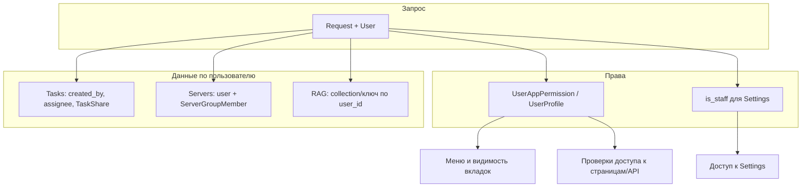

# Разграничение пользователей, права доступа и расшаривание

## Текущее состояние

- **Серверы**: уже привязаны к пользователю (`[servers/models.py](servers/models.py)` — `Server.user`, `ServerGroup.user`), есть группы и `ServerGroupMember` для совместного доступа.
- **Задачи**: модель имеет `created_by` и `assignee`, но `[tasks/views.py](tasks/views.py)` в `task_list` не фильтрует по пользователю и не защищена `@login_required` — отображаются все задачи.
- **RAG**: один глобальный движок и одна коллекция/память (`[app/rag/engine.py](app/rag/engine.py)`, `[app/rag/inmemory_rag.py](app/rag/inmemory_rag.py)`) — общая для всех.
- **Настройки**: страница и API настроек (`[core_ui/views.py](core_ui/views.py)` — `settings_view`, `api_settings`) доступны любому залогиненному пользователю.
- **Навигация**: в `[core_ui/templates/base.html](core_ui/templates/base.html)` все пункты меню (Chat, Orchestrator, Agents, Tasks, Knowledge Base, Servers, Settings) показываются всем одинаково.

Админ — через стандартный Django `User.is_staff` / `User.is_superuser` и `/admin/`.

---

## 1. Модель прав и контекст для шаблонов

**Цель**: хранить гибкие разрешения по пользователю и дать шаблонам/views доступ к ним.

- **Модель `UserAppPermission**` (например в приложении `core_ui` или новом `accounts`):
  - `user` (FK → `User`)
  - `feature` — slug: `agents` | `orchestrator` | `servers` | `tasks` | `knowledge_base` | `settings`
  - `allowed` — bool (по умолчанию `True` для всех, кроме `settings`)

Либо один профиль `**UserProfile**` с полями-флагами:

`can_agents`, `can_orchestrator`, `can_servers`, `can_tasks`, `can_knowledge_base`, `can_settings`.

Для «гибкой настройки» удобнее отдельная таблица `UserAppPermission(user, feature, allowed)`.

- Логика доступа:
  - `settings`: только если `user.is_staff` или есть разрешение `can_settings` (выдаёт админ).
  - Остальные вкладки: по умолчанию разрешены; админ может отключать через `UserAppPermission` / `UserProfile`.
- **Context processor** (или хелпер в `core_ui`):
  - Добавляет в контекст, например, `user_can_agents`, `user_can_orchestrator`, `user_can_servers`, `user_can_tasks`, `user_can_knowledge_base`, `user_can_settings` (и при необходимости `is_app_admin`).
  - Читать из `UserAppPermission`/`UserProfile`; для `settings` учитывать также `request.user.is_staff`.
- В `[web_ui/settings.py](web_ui/settings.py)` подключить этот context processor в `TEMPLATES[]['OPTIONS']['context_processors']`.

---

## 2. Ограничение доступа к настройкам

**Цель**: обычные пользователи не могут открывать настройки и ничего там менять.

- **Views**:
  - `settings_view`: доступ только если `request.user.is_staff` или есть право `can_settings`; иначе 403 или редирект на `index`.
  - `api_settings`: на GET — те же правила; на POST (изменение настроек) — только при наличии права на настройки / `is_staff`.
- **Навигация**: в `base.html` пункт «Settings» показывать только если `user_can_settings` (из context processor).
- **Клиент**: ссылки на настройки (например, бейдж модели в шапке) вести на `settings` только при `user_can_settings`, иначе не показывать или показывать без перехода.

---

## 3. Админ: управление разрешениями пользователей

**Цель**: админ может гибко включать/выключать доступ к вкладкам (Агенты, Оркестратор, Серверы, Задачи, Knowledge Base, Настройки).

- В **Django Admin** зарегистрировать модель прав:
  - Если используется `UserAppPermission`: отдельный `ModelAdmin` с фильтрами по пользователю и по `feature`, списком `user`/`feature`/`allowed`, инлайном под User при необходимости.
  - Если `UserProfile`: инлайн в кастомном User Admin или отдельная страница Profile с флажками.
- В списке пользователей админу должно быть понятно, у кого какие разрешения; при необходимости — отдельная страница «Права приложения» с фильтром по пользователю.

---

## 4. Изоляция по пользователям и расшаривание

### 4.1 Задачи (Tasks)

- **Изоляция**:
  - Во всех view задач добавить `@login_required` там, где его нет (в т.ч. `task_list`).
  - В `task_list` и во всех API по задачам фильтровать:
    - задачи, где `created_by=request.user` или `assignee=request.user`;
    - плюс задачи, к которым пользователь допущен через модель расшаривания (ниже).
- **Расшаривание**:
  - Модель `**TaskShare**` (в `tasks`):
    - `task` (FK → `Task`), `user` (FK → `User`), `can_edit` (bool, по умолчанию False).
  - В выборку «моих задач» добавлять задачи, для которых есть `TaskShare(task=task, user=request.user)`.
  - В `task_detail_api`, `task_update_status`, `task_delete`, `ai_improve_description`, `ai_breakdown` и т.д. — проверять не только владельца/исполнителя, но и доступ через `TaskShare` и `can_edit` там, где нужно изменение.
- Миграции: добавить `TaskShare`, при необходимости индекс по `(user, task)`.

### 4.2 Серверы (Servers)

- Уже изолированы по `user` и по членству в группах (`[servers/views.py](servers/views.py)` — `Server.objects.filter(user=request.user)`, группы через `memberships`). Оставляем как есть.
- Для расшаривания уже есть механизм групп и `ServerGroupMember`; при необходимости позже можно добавить «прямой шаринг» сервера с пользователем (отдельная модель), в рамках этого плана достаточно текущей модели групп.

### 4.3 RAG (Knowledge Base)

- **Изоляция «своя база на пользователя»**:
  - Вариант A (проще): у каждого пользователя своя коллекция/хранилище:
    - Qdrant: `collection_name = f"weu_knowledge_u{user_id}"` (или префикс в настройках).
    - InMemory: хранить в движке словарь `{user_id: list[doc]}`, все методы `add_text`/`query`/`get_documents`/`delete_document`/`reset_db` принимают `user_id` (или `request` в API).
  - Вариант B: одна коллекция с payload `user_id` и фильтр по нему при `query`/`scroll`/`delete` — возможен, но потребует явно протаскивать `user_id` во все вызовы RAG из views.
- **Изменения по слоям**:
  - **Рант RAG**: в `[app/rag/engine.py](app/rag/engine.py)` и при использовании InMemory — добавить параметр `user_id` (или `user`) во все публичные методы; внутри использовать коллекцию/ключ по `user_id`.
  - **API и синглтон**: сейчас один глобальный `get_rag_engine()`. Нужно либо:
    - фабрика `get_rag_engine(user_id)` / «движок за пользователя» (например, кэш по `user_id`),

либо

```
- один инстанс движка, но все методы которого принимают `user_id`.
```

- **Views** (`[core_ui/views.py](core_ui/views.py)`): во все RAG-эндпоинты (`rag_add_api`, `rag_query_api`, `rag_reset_api`, `rag_delete_api`, `rag_documents_api`, `api_upload_file` при добавлении в RAG) передавать `request.user.id`.
- Расшаривание RAG (общие «базы знаний» между пользователями) можно предусмотреть позже отдельной моделью и фильтрами по «пространствам» (space_id и допуск пользователя) — в базовом плане достаточно строгой изоляции «у каждого своя RAG».

---

## 5. Отображение меню по правам

**Цель**: показывать только те вкладки, на которые у пользователя есть разрешение.

- В `[core_ui/templates/base.html](core_ui/templates/base.html)`:
  - Оборачивать блоки пунктов меню условиями:
    - Chat — по желанию оставить всем или завести отдельное право (если решите ограничивать).
    - Orchestrator — показывать только при `user_can_orchestrator`.
    - Agents — при `user_can_agents`.
    - Tasks — при `user_can_tasks`.
    - Knowledge Base — при `user_can_knowledge_base`.
    - Servers — при `user_can_servers`.
    - Settings — при `user_can_settings` (уже описано выше).
- Там же скрыть или изменить ссылку «Перейти в настройки» с бейджа модели, если у пользователя нет `user_can_settings`.

---

## 6. Защита API и страниц по вкладкам

**Цель**: даже при прямом заходе по URL или вызове API доступ есть только при наличии права.

- **Страницы**:
  - `orchestrator_view` — проверять `user_can_orchestrator`; иначе 403.
  - `knowledge_base_view` — проверять `user_can_knowledge_base`.
  - Маршруты `agents` (agent_hub) — проверять `user_can_agents`.
  - `server_list` и остальные views серверов — проверять `user_can_servers`.
  - Страницы задач (в т.ч. `task_list`) — проверять `user_can_tasks`.
- **API**:
  - Эндпоинты оркестратора/чата, которые по смыслу относятся к «оркестратору» (например, tools, agents execute), защищать проверкой соответствующих прав.
  - RAG API — уже будут привязаны к `user_id`; дополнительно проверять `user_can_knowledge_base` при доступе к RAG.
  - API настроек — только при `user_can_settings`.

Удобно вынести проверки в декоратор или хелпер вида `require_feature('orchestrator')`, внутри которого используется общая логика прав из context processor / моделей.

---

## 7. Порядок внедрения (минимальные разрывы)

1. Модель прав и миграции (например, `UserAppPermission` в `core_ui`), создание/обновление профилей по умолчанию при миграции или в данных.
2. Context processor и использование `user_can_*` в `base.html` для меню.
3. Ограничение доступа к настройкам (views + API + скрытие пункта Settings).
4. Защита остальных страниц и API по признакам `user_can_*`.
5. Задачи: `@login_required` на всех views, фильтрация по `created_by`/`assignee` и модель `TaskShare` с проверками в views.
6. RAG: введение `user_id` в API и в движок (коллекция/ключ по пользователю).
7. Регистрация модели прав в Django Admin и при необходимости кастомизация отображения пользователя под «Права на вкладки».
8. При необходимости — доработка серверов (явная документация расшаривания через группы или отдельная модель прямого шаринга в отдельном шаге).

---

## Диаграмма потока прав и данных




---

## Важные файлы

| Что | Где |

|-----|-----|

| Модель прав / профиль | `core_ui/models.py` или новое приложение |

| Context processor | `core_ui/context_processors.py` (или аналог) + `web_ui/settings.py` |

| Ограничение настроек | `core_ui/views.py`: `settings_view`, `api_settings` |

| Меню по правам | `core_ui/templates/base.html` |

| Задачи: изоляция и шаринг | `tasks/models.py` (TaskShare), `tasks/views.py` (фильтры и проверки) |

| RAG по пользователю | `app/rag/engine.py`, `app/rag/inmemory_rag.py`, вызовы из `core_ui/views.py` |

| Защита страниц/API по вкладкам | `core_ui/views.py`, `tasks/views.py`, `servers/views.py`, `agent_hub/views.py` |

| Админ прав | Регистрация в `core_ui/admin.py` (или где живет модель прав) |

После этого у каждого пользователя будут свои сервера, задачи и RAG; обычные пользователи не смогут заходить в настройки и менять их; админ сможет гибко выдавать доступ к вкладкам (Агенты, Оркестратор, Серверы и т.д.); расшаривание задач будет через `TaskShare`, серверов — через существующие группы.