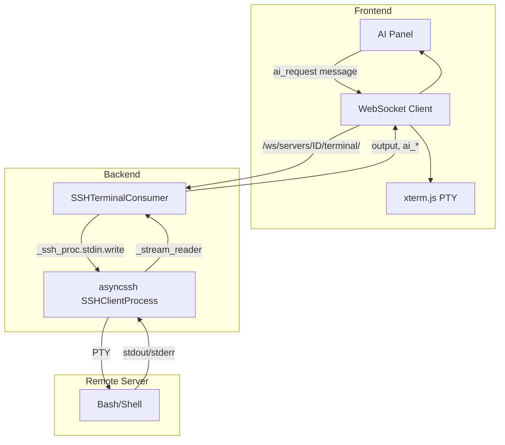

# Документация: Чат с подключённым сервером

Краткая справка по логике AI-чата в терминале сервера — для быстрого доступа без повторного сканирования проекта.

---

## Оглавление

1. [Обзор](#обзор)
2. [Архитектура: AI-чат в терминале](#архитектура-ai-чат-в-терминале)
3. [Ключевые файлы](#ключевые-файлы)
4. [Протокол WebSocket (JSON)](#протокол-websocket-json)
5. [Поток данных: от запроса до выполнения](#поток-данных-от-запроса-до-выполнения)
6. [Контекст для LLM](#контекст-для-llm)
7. [Отличия от основного чата и Task Executor](#отличия-от-основного-чата-и-task-executor)
8. [Модели и таблицы](#модели-и-таблицы)
9. [Варианты UI: multi-tab и minimal](#варианты-ui-multi-tab-и-minimal)

---

## Обзор

В платформе WEU есть **два разных потока** взаимодействия чата с серверами:

1. **Основной чат** (`/chat/`) — HTTP API, при упоминании сервера по имени выполняет команды через `ServerExecuteTool` (подключение на лету).
2. **AI-панель в терминале** (`/servers/<id>/terminal/`) — WebSocket, использует уже установленное SSH-соединение терминала, «печатает» команды в PTY.

Документ фокусируется на **втором потоке** — чате внутри терминала с подключённым сервером.

---

## Архитектура: AI-чат в терминале



---

## Ключевые файлы

| Файл | Назначение |
|------|------------|
| [servers/consumers.py](servers/consumers.py) | `SSHTerminalConsumer` — WebSocket, SSH, AI-логика |
| [servers/routing.py](servers/routing.py) | Маршрут WebSocket: `ws/servers/<int:server_id>/terminal/` |
| [servers/templates/servers/terminal.html](servers/templates/servers/terminal.html) | UI терминала + AI-панель, отправка `ai_request` |
| [servers/templates/servers/terminal_minimal.html](servers/templates/servers/terminal_minimal.html) | Минимальная версия терминала (отдельное окно) |
| [servers/templates/servers/multi_terminal.html](servers/templates/servers/multi_terminal.html) | Multi-tab: несколько серверов в одной вкладке |

---

## Протокол WebSocket (JSON)

### Client → Server

| type | Поля | Описание |
|------|------|----------|
| `connect` | master_password?, password?, cols?, rows?, term_type? | Подключение SSH |
| `input` | data | Клавиши в терминал |
| `resize` | cols, rows | Изменение размера PTY |
| `disconnect` | — | Отключение SSH |
| **`ai_request`** | **message** | **Запрос к AI (текст пользователя)** |
| `ai_confirm` | id | Подтвердить опасную команду |
| `ai_cancel` | id | Отменить команду |
| `ai_reply` | q_id, text | Ответ на ai_question |
| `ai_stop` | — | Остановить AI |
| `ping` | — | Keepalive |

### Server → Client

| type | Поля | Описание |
|------|------|----------|
| `ready` | server_id, server_name, auth_method, has_encrypted_secret | Терминал готов |
| `status` | status: connecting\|connected\|disconnected | Статус SSH |
| `output` | stream, data | Вывод терминала |
| `error` | message | Ошибка |
| `exit` | exit_status, exit_signal | Сессия завершена |
| **`ai_status`** | status: thinking\|running\|waiting_confirm\|idle\|generating_report\|analyzing_error | Состояние AI |
| **`ai_response`** | mode, assistant_text, commands | План/ответ AI |
| `ai_command_status` | id, status, exit_code?, reason? | Статус команды |
| `ai_report` | report, status | Итоговый отчёт |
| `ai_error` | message | Ошибка AI |
| `ai_recovery` | original_cmd, new_cmd, new_id, why | Retry после ошибки |
| `ai_question` | q_id, question, cmd, exit_code | Вопрос пользователю |
| `ai_install_progress` | cmd, elapsed, output_tail | Прогресс установки |

---

## Поток данных: от запроса до выполнения

### 1. Пользователь вводит сообщение в AI-панели

- **terminal.html**: [sendAiMessage()](servers/templates/servers/terminal.html) (~строка 1576), отправка на строке ~1591: `tabs[activeTabId].socket.send(JSON.stringify({type:'ai_request', message:text}))`.
- **terminal_minimal.html**: [sendAI()](servers/templates/servers/terminal_minimal.html) (~строка 997), отправка ~1002.
- **multi_terminal.html**: [sendAiMessage(tabId)](servers/templates/servers/multi_terminal.html) (~строка 1162), отправка ~1175 с учётом `tabId`.

### 2. SSHTerminalConsumer._handle_ai_request

- Файл: [servers/consumers.py](servers/consumers.py), метод [\_handle_ai_request](servers/consumers.py) (строка 396).
- Проверка: SSH подключён (`_ssh_proc`), сервер загружен.
- Сохранение сообщения в `_ai_history`.
- Отправка `ai_status: thinking`.

### 3. Получение правил и планирование

- [_get_ai_rules_and_forbidden](servers/consumers.py) (строка 1535) — загружает `GlobalServerRules`, правила группы сервера, контекст сети.
- [_ai_plan_commands](servers/consumers.py) (строка 1059) — вызывает LLM (`LLMProvider.stream_chat`), возвращает JSON:

```json
{
  "mode": "answer" | "execute" | "ask",
  "assistant_text": "текст пользователю",
  "commands": [{"cmd": "команда", "why": "зачем"}]
}
```

Фрагмент вызова (consumers.py, строки 419–426):

```python
forbidden_patterns, rules_context = await self._get_ai_rules_and_forbidden(self._user_id, self.server.id)
plan_obj = await self._ai_plan_commands(
    user_message=msg,
    rules_context=rules_context,
    terminal_tail=(self._terminal_tail or "")[-2000:],
    history=list(self._ai_history),
    unavailable_cmds=set(getattr(self, "_unavailable_cmds", set())),
)
```

### 4. Режимы ответа

- **answer / ask** — только текст, без команд. Отправка `ai_response` с `commands: []`.
- **execute** — формирование плана команд, проверка опасных: [_compute_confirm_reason](servers/consumers.py) (строка 1255) → `is_dangerous_command` (app/tools/safety.py), forbidden patterns.

### 5. Выполнение команд: _ai_process_queue

- Метод: [_ai_process_queue](servers/consumers.py) (строка 569).
- Для каждой команды:
  1. **Опасная** → `ai_status: waiting_confirm` → ожидание `ai_confirm` или `ai_cancel`.
  2. **Обычная** → [_ai_execute_command](servers/consumers.py)(cmd, item_id) (строка 825).

### 6. _ai_execute_command — выполнение в PTY

- Метод: [_ai_execute_command](servers/consumers.py) (строка 825).
- Печатает команду через `_ai_type_text` → `_ssh_proc.stdin.write`.
- Добавляет маркер для захвата exit code: `__WEUAI_EXIT_<id>=$?; echo "__WEUAI_EXIT_<id>:$?__"`.
- [_stream_reader](servers/consumers.py) (~1316) фильтрует маркер через [_filter_internal_markers](servers/consumers.py) (строка 1341), парсит exit code, вызывает [_set_ai_exit_code](servers/consumers.py) (строка 1399) → future завершается.
- Для streaming-команд (tail -f, journalctl -f) — Ctrl+C через 8 с.
- Для install-команд — `_monitor_install` с периодическими `ai_install_progress`.

### 7. Сбор вывода

- [_append_terminal_tail](servers/consumers.py) (строка 1407) — накапливает вывод (до 8k символов) для контекста следующего запроса.
- `_append_ai_output` — во время выполнения AI-команды копирует вывод в `_ai_active_output` (до 6k).

### 8. Адаптивное восстановление при ошибке

- Метод: [_ai_handle_error](servers/consumers.py) (строка 984).
- При `exit_code != 0` LLM решает: `retry` (новая команда в план), `skip`, `ask` (ai_question пользователю), `abort`.

### 9. Итоговый отчёт

- Метод: [_ai_make_report](servers/consumers.py) (строка 1162).
- После всех команд LLM формирует отчёт по выводу, отправка `ai_report`.

---

## Контекст для LLM

| Источник | Содержимое |
|----------|------------|
| `terminal_tail` | Последние 2000 символов вывода терминала |
| `history` | До 20 последних сообщений (user/assistant) |
| `rules_context` | GlobalServerRules + ServerGroup + network context |
| `unavailable_cmds` | Команды с exit=127 в этой сессии (netstat→ss, ifconfig→ip) |

---

## Отличия от основного чата и Task Executor

| Аспект | Терминал AI | Основной чат | Task Executor |
|--------|-------------|--------------|---------------|
| Транспорт | WebSocket | HTTP POST /api/chat/ | Синхронный вызов |
| SSH | Собственный `_ssh_proc` (asyncssh) | ServerExecuteTool (подключение на лету) | ssh_manager.connect → connection_id |
| connection_id | Не используется | Не используется | Используется |
| Выполнение команд | Ввод в PTY (`stdin.write`) | server_execute tool | ssh_execute(conn_id) |
| Оркестратор | Нет (свой LLM-промпт) | UnifiedOrchestrator | ReactAgent с execution_context |

---

## Модели и таблицы

- **Server** — сервер из `servers.models`.
- **ServerCommandHistory** — логирование команд AI ([_log_ai_command_history](servers/consumers.py) в consumers.py).
- **GlobalServerRules** — глобальные правила пользователя.

---

## Варианты UI: multi-tab и minimal

### Multi-tab (multi_terminal.html)

- Одна вкладка браузера, несколько терминалов по серверам.
- Для каждого сервера свой объект в `tabs[tabId]` с полями: `sid`, `name`, `host`, `port`, `user`, `socket`, `terminal`, и т.д.
- **activeTabId** — ID текущей вкладки; все сообщения WebSocket (в т.ч. `ai_response`, `ai_command_status`) обрабатываются только если `tid === activeTabId` (см. switch по `msg.type` в обработчике `onmessage`).
- Отправка AI-запроса: `sendAiMessage(tabId)` — передаётся явный `tabId`, используется `tabs[tabId].socket`.

### Minimal (terminal_minimal.html)

- Отдельное всплывающее окно (открывается с основной страницы терминала по кнопке «Minimal»).
- Один сервер, один WebSocket; структура `tabs` и `activeTabId` сохранена для совместимости с общим кодом.
- Отправка: `sendAI()` использует `tabs[activeTabId].socket.send(JSON.stringify({type:'ai_request', message:text}))`.
- Упрощённая вёрстка AI-панели и списка сообщений при том же протоколе WebSocket.

Один и тот же бэкенд [SSHTerminalConsumer](servers/consumers.py) обслуживает и полный терминал, и multi-tab, и minimal — различается только фронтенд (шаблон и привязка к вкладке).
